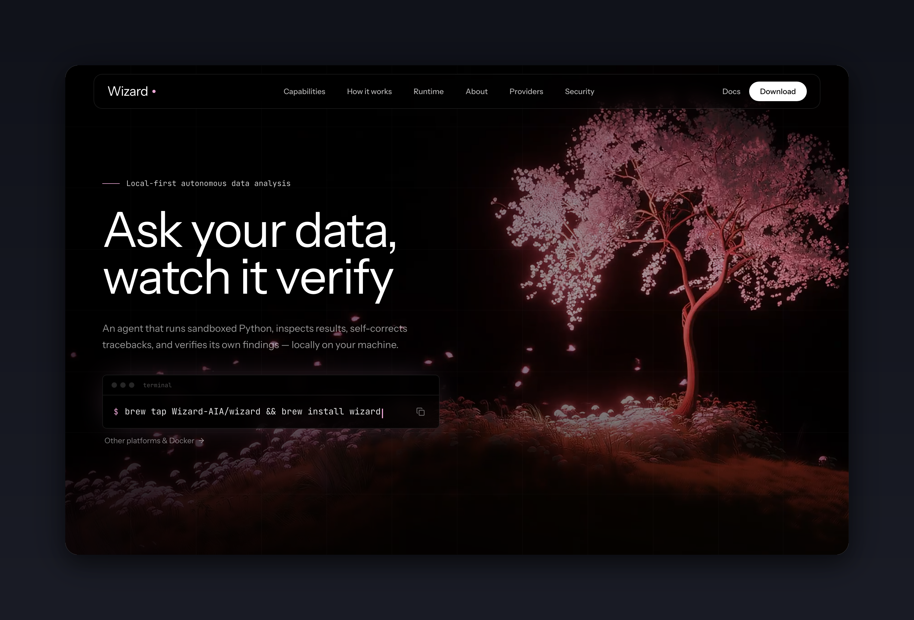

# Wizard Documentation & Landing Portal

Official landing page and documentation hub for **[Wizard](https://github.com/Wizard-AIA/Wizard-w2)** — the local-first autonomous AI data analysis agent.

<p align="center">
  
</p>

## 🚀 Overview

Built with:
- **Framework:** Next.js 16 (App Router + Turbopack)
- **Styling:** TailwindCSS v4 + Radix UI
- **Components:** Interactive 3D ASCII canvas, documentation search dialog, live code previews, and responsive landing sections.

## 🛠️ Development

```bash
pnpm install
pnpm dev
```

Open [http://localhost:3000](http://localhost:3000) in your browser.

## 📦 Static Production Build

```bash
pnpm build
```

Prerenders static HTML/CSS/JS ready for deployment on GitHub Pages, Cloudflare Pages, or Vercel.

## 📄 License

MIT / BSD-3-Clause — matching the core Wizard project.
