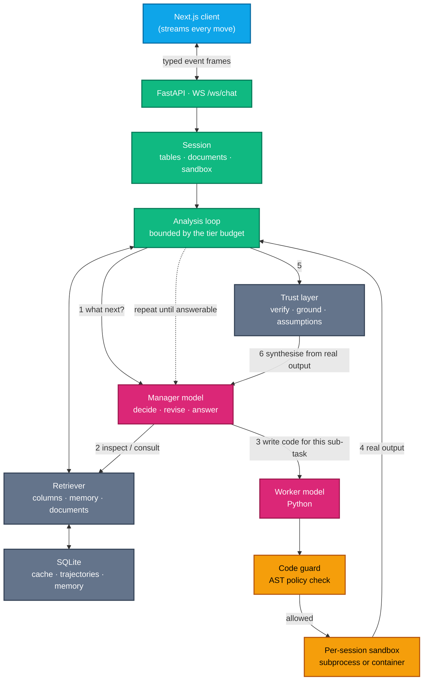

# Architecture

## One request path

Both the REST endpoint (`POST /api/chat`) and the WebSocket
(`WS /ws/chat`) call the same orchestrator. The transport only translates
internal events into frames for the client — it contains no workflow logic
of its own. That matters in practice: two implementations of the same loop
drift, and drift is where a feature works in the chat UI but not in the API,
or vice versa.

## This is a loop, not a pipeline

Each iteration, the manager model sees what has actually run and chooses the
next move; the run ends when it says it can answer, or the budget is spent.

The dotted line is the part that matters: step 4 feeds back into step 1. The
manager sees what the code actually produced and picks the next move from
it, so a plan that turns out to be wrong gets rewritten instead of carried
out regardless. Real analytical work is rarely one step — you find out a
join key is dirty, or that "active customer" means three different things in
three tables, only once you've looked. A fixed-plan design can't recover
from that; a loop can.

The old shape (fix a plan up front, feed 200 characters of each step's
output into the next) could not recover when the data contradicted the
plan. [DABstep](https://arxiv.org/abs/2506.23719) measures the gap this
closes: hard tasks need 6+ dependent steps, and the best model scored
14.55% on them versus 76.39% on single-step ones — with planning as the
largest error category.

## The actions available each iteration

| Action | What happens |
|---|---|
| `inspect` | Answered deterministically from the session state — no model call. Cheap enough to reach for often. |
| `code` | The worker writes Python for the current sub-task; it's statically screened, then executed. |
| `consult` | Retrieves from attached reference documents or installed skills. |
| `reflect` | The manager revises its plan given what's happened so far. |
| `parallel` | Fans one step out into several concurrent, isolated mini-investigations (larger models/tiers only). |
| `answer` | Ends the loop and triggers verification (unless running in `fast` mode). |

Malformed model output never crashes the loop — it resolves to a sensible
default (`code` mid-run, a forced `answer` on the final iteration). A small
model saying something unparseable shouldn't derail an otherwise-working
analysis.

## Depth and tiers

Three depths are available: **fast** (one shot, no verification — the
cheapest and least self-checking option), **auto** (the agent picks its own
depth), and **deep** (thorough, with a decision round-trip on every
iteration regardless of model size).

Below a certain model size, the loop stops asking the model to choose its
next action at all — reading the transcript and picking from three
options a small model doesn't reliably distinguish costs a round-trip and
buys nothing. Instead: a step that succeeded and printed something means
stop, anything else means write code. That's the difference between a
nine-call turn and a three-call one on a laptop-sized model. Picking **Deep**
in the composer restores the full round-trip at any size.

## Self-correction

When execution fails, the traceback is fed back into the worker's prompt and
the sub-task is retried, up to a configured limit. A failure that's
successfully repaired is remembered and shown as a counter-example the next
time a similar question comes up — so the same mistake doesn't repeat
itself. A sub-task that fails outright isn't fatal to the turn: it becomes
an observation, and the agent routes around it.

## Trust, not just an answer

See [Data Modes & Privacy](data-modes-and-privacy.md) for what leaves your
machine, but the trust layer itself runs regardless of provider:

- **Verification** re-derives the headline result by a different route and
  reports a match or mismatch. A wrong join grain produces a confident,
  plausible, wrong number that self-review by the same model wouldn't catch
  — a second, independent computation can.
- **Grounding** flags any number in the answer that appears in no execution
  output. Tolerance is based on the answer's own precision, so reporting
  `3.14` from an output of `3.14159` isn't flagged as invention.
- **Assumptions** are read back out of the code that actually ran — dropped
  nulls, an inner join, a top-N cut, a coerced date — because each one
  changes what the number means, and none of them are visible from the
  answer text alone.

This is deterministic, not another model call reviewing its own work, and it
reports rather than edits: it never rewrites the model's answer, only
annotates it.
