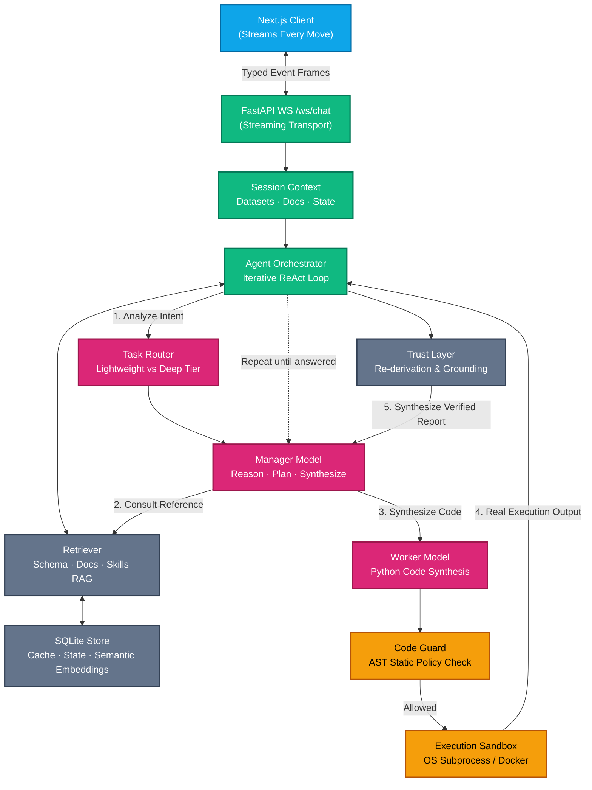

# Architecture & Control Plane

Wizard operates on an **autonomous iterative feedback loop** rather than a one-shot generation pipeline. Real data analysis requires observing real intermediary data, discovering dirty keys, pivoting strategies when assumptions fail, and independently verifying findings.

---

## 🏛️ High-Level System Architecture

---

## 🧠 Dual-Model Execution Roles

1. **Manager Role (`MODEL_NAME`):**
   - Directs the investigation strategy.
   - Formulates and tracks analytical hypotheses.
   - Decides whether to run code, consult reference documentation, branch into parallel investigations, or answer.
   - Synthesizes user-facing narratives from verified output.

2. **Worker Role (`WORKER_MODEL_NAME`):**
   - Writes production-grade Python code (using Pandas, DuckDB, Polars, or Scikit-Learn).
   - Constrained by AST policies and informed by the exact installed runtime capabilities.

3. **Task Complexity Router:**
   - Evaluates incoming turns.
   - Dispatches simple metadata/schema requests to fast, lightweight models.
   - Directs complex investigations to deep reasoning models.

---

## ⚖️ The Evidence-Backed Control Plane

Wizard incorporates multi-layered verification to ensure statistical soundness:

### 1. Adversarial Critic & Competing Methods
When answering ambiguous or high-stakes analytical questions, Wizard evaluates competing analytical routes (e.g. comparing Parametric vs Non-parametric tests, or Logistic Regression vs Random Forest) to verify consensus.

### 2. Result Grounding Check
Every numerical claim in the final answer is traced back to actual execution stdout. Any ungrounded figures (numbers fabricated without execution backing) are prominently flagged.

### 3. Headline Result Re-Derivation
The central conclusion is independently computed through an alternative calculation path (e.g., cross-checking SQL aggregate output with native Python arithmetic).

### 4. Transparent Assumption Extraction
Silent code decisions — such as dropped null values, inner join data loss, coerced timestamp formats, or top-N truncations — are extracted and surfaced alongside the final answer.

---

## 🛡️ Sandboxing & Execution Isolation

Generated Python code runs in strictly bounded environments:

- **Host Mode (`EXECUTION_BACKEND=host`, Default):**
  - **Linux:** Enforced via `Landlock` filesystem restriction and `seccomp` system call filtering (AF_INET outbound blocked).
  - **macOS:** Enforced via `sandbox-exec` profiles with denied network and read/write confinement to the session directory.
  - **Windows:** Enforced via Windows Job Objects and Low Integrity security tokens.
- **Docker Mode (`EXECUTION_BACKEND=docker`):**
  - Dedicated per-session container with `cap_drop=ALL`, `no-new-privileges`, memory/PID ceilings, and optional gVisor (`runsc`) kernel isolation.
