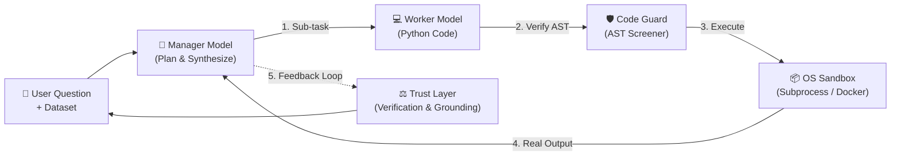

# 🧙‍♂️ Wizard Documentation

A local-first autonomous data analysis agent. Investigates, executes real code in secure sandboxes, self-corrects on errors, and independently verifies conclusions.

[Download & Install :material-arrow-right:](getting-started/installation.md){ .md-button .md-button--primary }
[5-Minute Quickstart :material-lightning-bolt:](getting-started/quickstart.md){ .md-button }
[GitHub Repository :fontawesome-brands-github:](https://github.com/Wizard-AIA/Wizard-w2){ .md-button }

---

## ⚡ Explore the Docs

-   :material-rocket-launch:{ .lg .middle } __Getting Started__

    ---

    Step-by-step installation guides for macOS, Linux, and Windows using standalone pre-built binaries, Docker Compose, or source code.

    [:material-arrow-right: Installation Guide](getting-started/installation.md) · [:material-arrow-right: CLI Reference](getting-started/cli.md)

-   :material-brain:{ .lg .middle } __Architecture & Concepts__

    ---

    Deep dive into the ReAct agent loop, dual Manager/Worker model dispatch, Evidence-Backed Control Plane, and OS sandboxing.

    [:material-arrow-right: Architecture](concepts/architecture.md) · [:material-arrow-right: Task Routing](concepts/routing-and-tiers.md)

-   :material-chart-line:{ .lg .middle } __Task Guides__

    ---

    Practical playbooks for running automated exploratory data analysis (EDA), training machine learning models, and exporting runnable scripts.

    [:material-arrow-right: Exploratory Analysis](guides/exploratory-data-analysis.md) · [:material-arrow-right: Model Training](guides/model-training.md)

-   :material-code-brackets:{ .lg .middle } __API & Reference__

    ---

    Exhaustive reference for all configuration options, FastAPI REST routes, WebSocket streaming event frames, and data connectors.

    [:material-arrow-right: Configuration](reference/configuration.md) · [:material-arrow-right: API Protocol](reference/api.md)

---

## 🔄 How Wizard Works

1. **Manager Plans & Reasons:** Formulates hypotheses and chooses the next analytical move.
2. **Worker Generates Code:** Writes targeted Python code using **DuckDB**, **Polars**, or **Pandas**.
3. **AST Guard Screens Code:** Prevents dangerous system operations or interpreter traversal.
4. **Execution in Sandbox:** Runs inside OS-contained subprocesses (Landlock/seccomp on Linux, `sandbox-exec` on macOS, Job Objects on Windows) or Docker.
5. **Real Feedback & Self-Correction:** The manager inspects the real output and tracebacks, self-correcting mistakes automatically.
6. **Trust Verification:** Re-derives headline numbers by an alternative route and flags any ungrounded figures.

---

## 🛡️ Local vs Cloud Data Modes

| Capability | Local Mode (`local-only`) | Cloud Permitted (`cloud-permitted`) |
|---|---|---|
| **Privacy Guarantee** | 100% On-Device (Zero data egress) | External LLM API calls permitted |
| **Model Backends** | Ollama, LM Studio, Bionic, Local vLLM | OpenAI, Anthropic, Custom Gateways |
| **Embeddings** | Local sentence embeddings (`embeddinggemma`) | Remote embedding APIs |
| **Network Egress** | Denied by default at sandbox layer | Outbound package install on demand |
